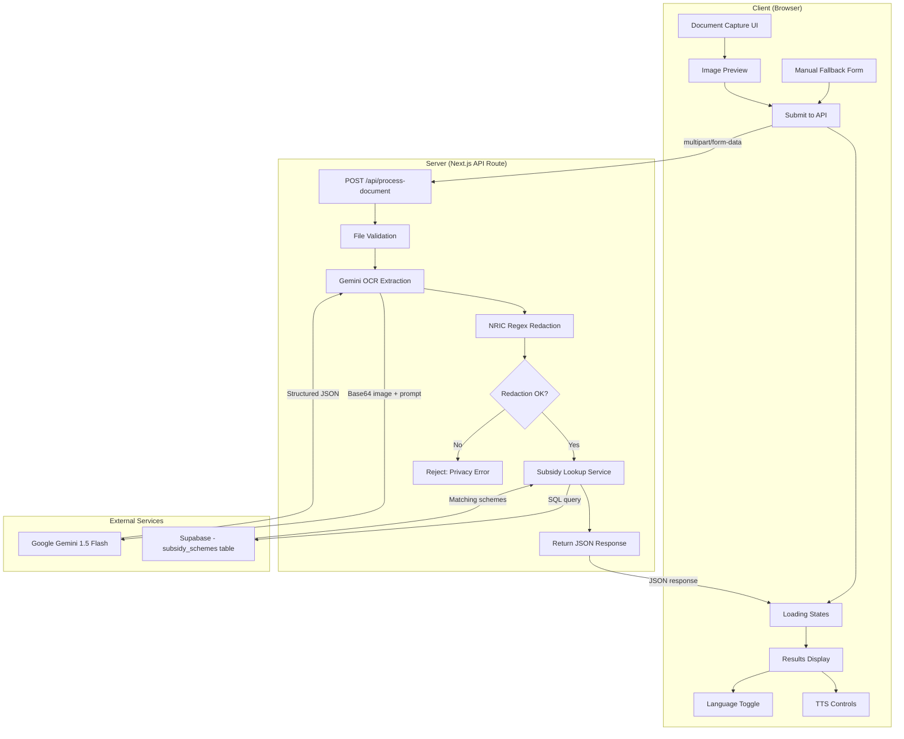
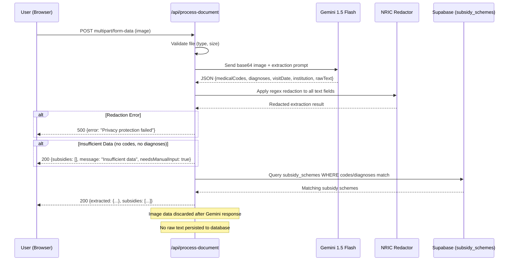
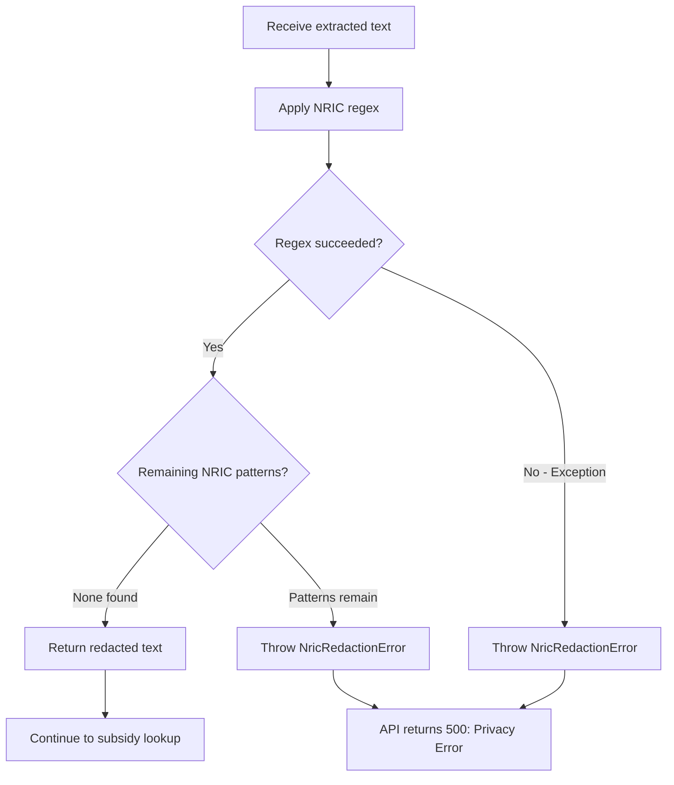

# Design Document: SubsidyKaki Subsidy Checker

## Overview

SubsidyKaki is a privacy-first, accessibility-oriented web application that helps elderly users in Singapore understand their medical subsidy eligibility by photographing medical documents. The system processes documents through a stateless pipeline: capture → OCR extraction → NRIC redaction → subsidy lookup → multilingual results with Text-to-Speech.

The architecture prioritises:
- **Privacy**: Fail-closed NRIC redaction, no image persistence, no raw text storage
- **Accessibility**: Large touch targets (44×44px), large fonts (18px body / 24px headings), WCAG 2.1 AA contrast, TTS at 0.7–0.75x speed
- **Simplicity**: Single-page flow targeting elderly users with minimal cognitive load
- **Stateless processing**: Document images exist only in server memory during the API call

### Key Design Decisions

| Decision | Rationale |
|----------|-----------|
| Dual-layer NRIC redaction (Gemini prompt + deterministic regex) | LLM-based redaction alone is probabilistic; regex provides a guaranteed safety net |
| Fail-closed on redaction errors | Privacy breach is worse than a failed request for this demographic |
| Web Speech API for TTS | No server-side TTS costs; works offline after page load; supports Singapore locales |
| Supabase for subsidy data only (not document storage) | Aligns with stateless processing requirement; subsidy_schemes is read-only reference data |
| Client-side language state | Avoids server round-trips for language switching; TTS voice selection is browser-native |

## Architecture

### System Architecture Diagram



### Request Sequence Diagram



## Components and Interfaces

### Client Components

```typescript
// ============================================================
// src/components/DocumentCapture.tsx
// ============================================================

interface DocumentCaptureProps {
  onSubmit: (file: File) => void;
  isProcessing: boolean;
}

// States: idle | preview | submitting | error
// Accepts: JPEG, PNG, WebP, HEIC, PDF (≤10MB, PDF ≤5 pages)
// Provides: camera button, file upload button, image preview, confirm/retake

// ============================================================
// src/components/LoadingProgress.tsx
// ============================================================

type ProcessingStage = "uploading" | "reading" | "finding";

interface LoadingProgressProps {
  stage: ProcessingStage;
  onTimeout: () => void;
  timeoutMs?: number; // default 30000
}

// Displays animated indicator with stage-specific text:
//   uploading → "Uploading your document..."
//   reading   → "Reading your document..."
//   finding   → "Finding your subsidies..."
// Auto-triggers onTimeout after 30s per stage

// ============================================================
// src/components/ResultsDisplay.tsx
// ============================================================

interface SubsidyResult {
  schemeName: string;
  coverageDescription: string;
  eligibilityConditions: string;
  estimatedCoveragePercent: number;
  translations: Record<SupportedLanguage, {
    schemeName: string;
    coverageDescription: string;
    eligibilityConditions: string;
  } | null>;
}

type SupportedLanguage = "en-SG" | "cmn-Hans-CN" | "ms-MY" | "ta-IN";

interface ResultsDisplayProps {
  subsidies: SubsidyResult[];
  language: SupportedLanguage;
  extractedData: ExtractedDocumentData;
}

// Renders subsidy cards ordered by estimatedCoveragePercent (desc)
// Shows summary count at top
// Falls back to English if translation unavailable for selected language

// ============================================================
// src/components/TTSControls.tsx
// ============================================================

interface TTSControlsProps {
  textContent: string;
  language: SupportedLanguage;
  isSupported: boolean; // derived from window.speechSynthesis check
}

// States: idle | playing | paused
// Provides: Read Aloud button (44×44px), Pause button, Stop button
// Highlights current spoken segment
// Rate: 0.7–0.75x normal speed

// ============================================================
// src/components/LanguageToggle.tsx
// ============================================================

interface LanguageToggleProps {
  current: SupportedLanguage;
  onChange: (lang: SupportedLanguage) => void;
}

// Four-option toggle: English | 中文 | Melayu | தமிழ்
// 44×44px minimum touch targets

// ============================================================
// src/components/ManualFallbackForm.tsx
// ============================================================

interface ManualFallbackFormProps {
  onSubmit: (data: ManualInputData) => void;
  isProcessing: boolean;
}

interface ManualInputData {
  birthYear: number;
  clinicType: "public_hospital" | "polyclinic" | "gp_clinic";
  chronicConditions: string[];
}

// Displayed when OCR cannot extract birth year OR clinic type
// Birth year dropdown (1920–current year)
// Clinic type selector (3 options)
// Chronic condition checkboxes (from CDMP list)
```

### Server-Side Modules

```typescript
// ============================================================
// src/lib/nric-redactor.ts
// ============================================================

/**
 * Dual-layer NRIC redaction:
 * Layer 1: Gemini prompt instructs model to redact during extraction
 * Layer 2: Deterministic regex applied to ALL output text fields
 *
 * Fail-closed: if regex execution throws, the entire request is rejected.
 */

interface RedactionResult {
  success: boolean;
  redactedText: string;
  redactionCount: number;
}

/**
 * Redacts all NRIC patterns from text.
 * Full NRIC: [STFG]\d{7}[A-Z] (case-insensitive)
 * Partial NRIC: [STFG]\d{4,6}[A-Z] (case-insensitive)
 * Returns RedactionResult with fail-closed semantics.
 */
export function redactNric(text: string): RedactionResult;

/**
 * Applies redaction to all string fields in an extracted document.
 * Throws NricRedactionError if any field fails redaction.
 */
export function redactExtractedData(data: RawExtractedData): RedactedExtractedData;

// ============================================================
// src/lib/subsidy-lookup.ts
// ============================================================

interface SubsidyScheme {
  id: string;
  scheme_name: string;
  scheme_type: "pioneer" | "merdeka" | "chas_blue" | "chas_orange" | "chas_green" | "medisave_cdmp" | "medishield_life" | "medifund";
  eligible_birth_year_min: number | null;
  eligible_birth_year_max: number | null;
  eligible_clinic_types: ("public_hospital" | "polyclinic" | "gp_clinic")[];
  medical_codes: string[];
  condition_keywords: string[];
  coverage_description: string;
  eligibility_conditions: string;
  estimated_coverage_percent: number;
  translations: Record<SupportedLanguage, {
    scheme_name: string;
    coverage_description: string;
    eligibility_conditions: string;
  } | null>;
}

interface SubsidyLookupParams {
  medicalCodes: string[];
  diagnoses: string[];
  institution: string | null;
  birthYear?: number;
  clinicType?: "public_hospital" | "polyclinic" | "gp_clinic";
}

interface SubsidyLookupResult {
  subsidies: SubsidyResult[];
  message: string | null;
  needsManualInput: boolean;
}

/**
 * Queries Supabase subsidy_schemes table.
 * Matches on medical codes OR diagnosis keywords.
 * Filters by institution type mapping.
 * Returns empty with message if no codes/diagnoses provided.
 */
export async function lookupSubsidies(
  params: SubsidyLookupParams
): Promise<SubsidyLookupResult>;

/**
 * Filters subsidy schemes by birth year eligibility.
 * A scheme matches if:
 *   - eligible_birth_year_min is null (no lower bound), AND
 *   - eligible_birth_year_max is null (no upper bound), OR
 *   - birthYear falls within [eligible_birth_year_min, eligible_birth_year_max] (inclusive)
 * If birthYear is undefined, birth-year-gated schemes (Pioneer, Merdeka)
 * are included with a requiresVerification flag set to true.
 */
export function filterByBirthYear(
  schemes: SubsidyScheme[],
  birthYear: number | undefined
): SubsidyScheme[];

// ============================================================
// src/lib/ocr-pipeline.ts
// ============================================================

interface RawExtractedData {
  medicalCodes: string[];
  diagnoses: string[];
  visitDate: string | null;
  institution: string | null;
  rawText: string;
}

interface RedactedExtractedData {
  medicalCodes: string[];
  diagnoses: string[];
  visitDate: string | null;
  institution: string | null;
  rawText: string;  // All NRIC patterns replaced with [REDACTED]
}

type ExtractedDocumentData = RedactedExtractedData;

/**
 * Full pipeline: validate → extract via Gemini → redact → return.
 * Image data is NOT persisted at any point.
 */
export async function processDocument(
  fileBuffer: ArrayBuffer,
  mimeType: string
): Promise<{ extracted: RedactedExtractedData }>;
```

### API Route Interface

```typescript
// POST /api/process-document
// Content-Type: multipart/form-data

// Request body:
// - file: File (JPEG, PNG, WebP, HEIC, PDF; max 10MB)
// - birthYear?: string (optional, from manual fallback)
// - clinicType?: string (optional, from manual fallback)
// - chronicConditions?: string (optional, JSON array from manual fallback)

// Success Response (200):
interface ProcessDocumentResponse {
  extracted: ExtractedDocumentData;
  subsidies: SubsidyResult[];
  message: string | null;
  needsManualInput: boolean;
}

// Error Responses:
// 400: { error: "No file provided" }
// 400: { error: "Unsupported file type" }
// 400: { error: "File too large (max 10MB)" }
// 400: { error: "PDF exceeds 5 page limit" }
// 500: { error: "Privacy protection failed - document rejected" }
// 500: { error: "Document extraction failed" }
// 500: { error: "Subsidy lookup failed" }
// 504: { error: "Processing timed out" }
```

## Data Models

### Supabase Schema: `subsidy_schemes` Table

```sql
CREATE TABLE subsidy_schemes (
  id UUID PRIMARY KEY DEFAULT gen_random_uuid(),
  scheme_name TEXT NOT NULL,
  scheme_type TEXT NOT NULL CHECK (scheme_type IN (
    'pioneer', 'merdeka', 'chas_blue', 'chas_orange', 'chas_green',
    'medisave_cdmp', 'medishield_life', 'medifund'
  )),
  eligible_birth_year_min INTEGER,        -- NULL means no lower bound
  eligible_birth_year_max INTEGER,        -- NULL means no upper bound
  eligible_clinic_types TEXT[] NOT NULL,   -- e.g., {'public_hospital', 'polyclinic'}
  medical_codes TEXT[] NOT NULL DEFAULT '{}',       -- ICD-10/SNOMED codes
  condition_keywords TEXT[] NOT NULL DEFAULT '{}',  -- diagnosis keyword matches
  coverage_description TEXT NOT NULL,
  eligibility_conditions TEXT NOT NULL,
  estimated_coverage_percent INTEGER NOT NULL CHECK (
    estimated_coverage_percent >= 0 AND estimated_coverage_percent <= 100
  ),
  translations JSONB NOT NULL DEFAULT '{}',
  -- translations shape: { "cmn-Hans-CN": {...}, "ms-MY": {...}, "ta-IN": {...} }
  created_at TIMESTAMPTZ NOT NULL DEFAULT now(),
  updated_at TIMESTAMPTZ NOT NULL DEFAULT now()
);

-- Index for medical code lookups
CREATE INDEX idx_subsidy_schemes_medical_codes ON subsidy_schemes USING GIN (medical_codes);

-- Index for condition keyword lookups
CREATE INDEX idx_subsidy_schemes_condition_keywords ON subsidy_schemes USING GIN (condition_keywords);

-- Index for clinic type filtering
CREATE INDEX idx_subsidy_schemes_clinic_types ON subsidy_schemes USING GIN (eligible_clinic_types);
```

### Client State Model

```typescript
// Main application state (managed in page component)
interface AppState {
  // Flow state
  stage: "capture" | "processing" | "results" | "error" | "manual-input";
  processingStage: ProcessingStage | null;

  // Data
  selectedFile: File | null;
  previewUrl: string | null;
  extractedData: ExtractedDocumentData | null;
  subsidyResults: SubsidyResult[];
  
  // UI preferences
  language: SupportedLanguage;
  
  // Error state
  error: {
    message: string;
    retryable: boolean;
    stage?: ProcessingStage;
  } | null;
}
```

### NRIC Pattern Definitions

```typescript
// Full NRIC: prefix letter + 7 digits + suffix letter
const FULL_NRIC_PATTERN = /[STFGstfg]\d{7}[A-Za-z]/g;

// Partial NRIC: prefix letter + 4-6 digits + suffix letter
const PARTIAL_NRIC_PATTERN = /[STFGstfg]\d{4,6}[A-Za-z]/g;

// Combined pattern for single-pass redaction
const ALL_NRIC_PATTERN = /[STFGstfg]\d{4,7}[A-Za-z]/g;
```


## Correctness Properties

*A property is a characteristic or behavior that should hold true across all valid executions of a system—essentially, a formal statement about what the system should do. Properties serve as the bridge between human-readable specifications and machine-verifiable correctness guarantees.*

### Property 1: File Validation Correctness

*For any* file submission with a given MIME type and file size, the validation function SHALL accept the file if and only if the MIME type is one of {image/jpeg, image/png, image/webp, image/heic, application/pdf} AND the file size is ≤ 10MB; otherwise it SHALL reject the file with an appropriate error message.

**Validates: Requirements 1.2, 1.4, 1.5, 2.9**

### Property 2: OCR Response Parsing Produces Valid Structure

*For any* valid JSON string returned by Gemini that contains the expected fields (medicalCodes, diagnoses, visitDate, institution, rawText), parsing SHALL produce an object where medicalCodes is an array of strings, diagnoses is an array of strings, visitDate is either a valid ISO 8601 date string or null, institution is either a string or null, and rawText is a string. Missing fields SHALL default to null or empty array as appropriate.

**Validates: Requirements 2.7, 2.11**

### Property 3: Empty Extraction Detection

*For any* extraction result where medicalCodes is empty AND diagnoses is empty AND visitDate is null AND institution is null, the system SHALL classify the extraction as failed and trigger the "document could not be read" error path.

**Validates: Requirements 2.6**

### Property 4: NRIC Redaction Completeness

*For any* input string containing one or more NRIC patterns (full: [STFG]\d{7}[A-Za-z], or partial: [STFG]\d{4,6}[A-Za-z]), after applying the redactNric function, the output string SHALL contain zero substrings matching any NRIC pattern, AND the output SHALL contain exactly as many "[REDACTED]" placeholders as there were NRIC patterns in the input.

**Validates: Requirements 3.1, 3.2, 3.5**

### Property 5: NRIC Redaction Fail-Closed

*For any* input (including null, undefined, or strings containing characters that could cause regex exceptions), if the redaction function encounters any error during processing, the function SHALL throw an NricRedactionError rather than returning potentially unredacted text.

**Validates: Requirements 3.6**

### Property 6: Subsidy Query Decision Logic

*For any* extraction result, the subsidy lookup service SHALL execute a database query if and only if medicalCodes contains at least one non-empty string OR diagnoses contains at least one non-empty string. When both are empty or null, it SHALL skip the query and return a "insufficient data" message with needsManualInput set to true.

**Validates: Requirements 5.1, 5.7**

### Property 7: Subsidy Lookup Completeness and Filtering

*For any* set of subsidy_schemes in the database and any valid lookup query (with medicalCodes, diagnoses, and institution), the lookup result SHALL include every scheme whose medical_codes or condition_keywords overlap with the query parameters AND whose eligible_clinic_types include the mapped clinic type of the query institution. No matching scheme SHALL be omitted from results.

**Validates: Requirements 5.2, 5.5**

### Property 8: Results Ordering by Coverage

*For any* non-empty array of SubsidyResult objects, when displayed in the results view, they SHALL be ordered such that for every consecutive pair (result[i], result[i+1]), result[i].estimatedCoveragePercent >= result[i+1].estimatedCoveragePercent.

**Validates: Requirements 6.1**

### Property 9: Language Display with English Fallback

*For any* SubsidyResult and any selected SupportedLanguage, the displayed text SHALL use the translation for the selected language if translations[language] is non-null; otherwise it SHALL display the English (default) text. No display field SHALL ever be empty or null.

**Validates: Requirements 6.5, 6.7**

### Property 10: TTS Configuration Correctness

*For any* TTS invocation with a selected SupportedLanguage, the SpeechSynthesisUtterance SHALL have: (a) rate set to a value in the range [0.7, 0.75] inclusive, and (b) lang set to the locale code matching the selected language ("en-SG", "cmn-Hans-CN", "ms-MY", or "ta-IN").

**Validates: Requirements 7.3, 7.9**

## Error Handling

### Strategy Overview

The application uses two distinct error handling strategies depending on the sensitivity of the operation:

| Context | Strategy | Rationale |
|---------|----------|-----------|
| NRIC redaction | **Fail-closed** | Privacy breach is catastrophic for this user group; better to fail the request than risk exposure |
| OCR extraction | **Fail-graceful** | Partial data is still useful; user can retry or use manual fallback |
| Subsidy lookup | **Fail-graceful** | Database issues are transient; user gets clear message and retry option |
| File validation | **Fail-fast** | Invalid input should be rejected immediately with actionable feedback |
| TTS playback | **Fail-silent** | TTS unavailability should not block access to visual results |

### Error Types and Handling

```typescript
// Base error classes
class SubsidyKakiError extends Error {
  constructor(
    message: string,
    public readonly userMessage: string,
    public readonly retryable: boolean,
    public readonly stage?: ProcessingStage
  ) {
    super(message);
  }
}

class NricRedactionError extends SubsidyKakiError {
  constructor(cause?: Error) {
    super(
      `NRIC redaction failed: ${cause?.message ?? "unknown"}`,
      "Privacy protection failed — document rejected for your safety. Please try again.",
      true,
      "reading"
    );
  }
}

class OcrExtractionError extends SubsidyKakiError {
  constructor(cause?: Error) {
    super(
      `OCR extraction failed: ${cause?.message ?? "unknown"}`,
      "We couldn't read your document. Please retake the photo with better lighting.",
      true,
      "reading"
    );
  }
}

class SubsidyLookupError extends SubsidyKakiError {
  constructor(cause?: Error) {
    super(
      `Subsidy lookup failed: ${cause?.message ?? "unknown"}`,
      "We couldn't find subsidy information right now. Please try again later.",
      true,
      "finding"
    );
  }
}

class FileValidationError extends SubsidyKakiError {
  constructor(message: string, userMessage: string) {
    super(message, userMessage, false);
  }
}

class TimeoutError extends SubsidyKakiError {
  constructor(stage: ProcessingStage) {
    super(
      `${stage} timed out after 30s`,
      "This is taking longer than expected. Please try again.",
      true,
      stage
    );
  }
}
```

### Fail-Closed Redaction Pipeline



### Client Error Recovery

- All retryable errors retain the original file in memory so the user does not need to re-upload
- Non-retryable errors (file validation) provide immediate actionable feedback
- Network errors trigger automatic retry (1 attempt) before showing error to user
- Progress indicator is replaced by error card with prominent "Try Again" button (44×44px)

## Testing Strategy

### Framework and Libraries

- **Test runner**: Vitest (fast, native ESM, TypeScript-first)
- **Property-based testing**: fast-check (de facto standard for JS/TS PBT)
- **Component testing**: React Testing Library + jsdom
- **Mocking**: Vitest built-in mocking (vi.mock, vi.fn)

### Test Categories

#### 1. Property-Based Tests (fast-check)

Each correctness property maps to one property-based test with minimum 100 iterations. Tests are tagged with property references.

| Property | Test File | What It Generates |
|----------|-----------|-------------------|
| Property 1: File validation | `file-validation.property.test.ts` | Random MIME types × file sizes |
| Property 2: OCR parsing | `ocr-pipeline.property.test.ts` | Random JSON strings with field variations |
| Property 3: Empty extraction | `ocr-pipeline.property.test.ts` | Random empty/null field combinations |
| Property 4: NRIC redaction completeness | `nric-redactor.property.test.ts` | Random text with embedded NRICs |
| Property 5: NRIC fail-closed | `nric-redactor.property.test.ts` | Adversarial inputs (null, special chars) |
| Property 6: Query decision | `subsidy-lookup.property.test.ts` | Random code/diagnosis arrays |
| Property 7: Lookup completeness | `subsidy-lookup.property.test.ts` | Random schemes × queries |
| Property 8: Results ordering | `results-display.property.test.ts` | Random subsidy result arrays |
| Property 9: Language fallback | `results-display.property.test.ts` | Random results × language selections |
| Property 10: TTS config | `tts-controls.property.test.ts` | All 4 language × rate combinations |

**Configuration:**
```typescript
// vitest.config.ts property test settings
fc.configureGlobal({ numRuns: 100 });
```

**Tagging format:**
```typescript
it("Feature: medicsnap-subsidy-checker, Property 4: NRIC Redaction Completeness", () => {
  fc.assert(fc.property(/* ... */));
});
```

#### 2. Unit Tests (Vitest)

Focused on specific examples, edge cases, and integration points:

- File validation: boundary cases (exactly 10MB, 5-page PDF)
- NRIC regex: known NRIC formats, case variations, embedded in sentences
- Subsidy lookup: specific scheme matching scenarios
- Results display: rendering with 0, 1, many results
- TTS: Web Speech API unavailable scenario
- Loading states: stage transitions, timeout boundaries

#### 3. Integration Tests

- API route end-to-end with mocked Gemini (verify full pipeline)
- Supabase query correctness with test data
- Client → API → response flow with MSW (Mock Service Worker)

### Test File Structure

```
src/
├── lib/
│   ├── __tests__/
│   │   ├── nric-redactor.test.ts              # Unit tests
│   │   ├── nric-redactor.property.test.ts     # PBT
│   │   ├── subsidy-lookup.test.ts             # Unit tests
│   │   ├── subsidy-lookup.property.test.ts    # PBT
│   │   ├── ocr-pipeline.test.ts              # Unit tests
│   │   ├── ocr-pipeline.property.test.ts     # PBT
│   │   └── file-validation.property.test.ts  # PBT
│   └── ...
├── components/
│   ├── __tests__/
│   │   ├── ResultsDisplay.test.tsx
│   │   ├── results-display.property.test.ts   # PBT
│   │   ├── TTSControls.test.tsx
│   │   ├── tts-controls.property.test.ts      # PBT
│   │   ├── DocumentCapture.test.tsx
│   │   ├── LoadingProgress.test.tsx
│   │   └── ManualFallbackForm.test.tsx
│   └── ...
└── app/
    └── api/
        └── process-document/
            └── __tests__/
                └── route.integration.test.ts   # Integration test
```

### Key Testing Decisions

| Decision | Rationale |
|----------|-----------|
| fast-check over custom generators | Industry-standard shrinking, arbitrary composition, reproducible seeds |
| Vitest over Jest | Native ESM support for Next.js 14, faster execution, same API surface |
| Mock Gemini API in all tests | External service; deterministic tests require controlled responses |
| Mock Supabase in property tests | Focus on lookup logic correctness, not database connectivity |
| Real Supabase in integration tests | Verify actual query syntax and response parsing |
| No E2E browser tests in this spec | Separate concern; accessibility testing requires manual + axe-core audit |
